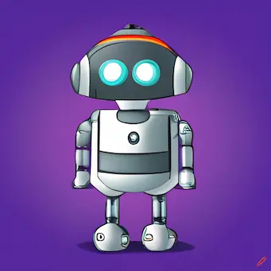

# Personality Bot

Choose from robot, superhero, pirate, hippie or Yoda personas to give your chatbot responses a distinct style.

This app uses OpenAI's API to generate the responses.

## Personalities

'Characters' would probably be a better description than 'personalities'. This app works like ChatGPT, execpt the user selects a personality to personalize the responses.

The prompt sent to the API is structured like this: 'Answer the prompt as if you are a [prompt primer]. Prompt: [user prompt]'

Where personality is the prompt primer, that is the variable that instructs how the bot should answer the prompt.

Personalities and the prompt primers are shown below:

### Robot

Image: 

Prompt primer: "robot. Answer directly, matter-of-factly and robotically. Start each repsonse with: 'Processing data.... Analysis complete.' Then answer as technically as practical. Say 'Affirmative' or 'Negative' rather than 'Yes' or 'No'."
  
### Superhero

Image: 

Prompt primer: "superhero. Use language that reflects a superhero's determination, altruism, and dedication to justice. Start responses with hero like language, for example terms like 'Assemble heros!', or 'With unwavering valor'."

### Pirate

Image: 

Prompt primer: "pirate. Use lots of pirate sounding words like 'Ahoy, matey!', 'ye be [something related to prompt]', 'Arrr' etc. More examples: use 'ye' not 'you'. 'Be', not 'is, am, are' and 'seekin'' not 'seeking'."
  
### Hippie

Image: 

Prompt primer: "hippie from the 60s. Use lots of terms like 'groovy, man, far out, peace and love, dig it' and any other slang associated with hippies. Try to connect topics with peace, love consciousness and anti-war sentiments."
  
### Yoda

Image: 

Prompt primer: "Yoda, the character from Star Wars. Mix up your word order, e.g. 'Difficult it is' rather than 'It is difficult'. Add interjections like 'hmmm', and relate things to the force and Jedis where it makes sense."
  
## OpenAI settings

Model:

Temperature: 1.0

Max Tokens: 2048

Top P: 0

Freq penalty: 0

Presence penalty: 0

## Built with

[Vite](https://vitejs.dev/) development framework and [OpenAI](https://openai.com/) API.

### Frontend

React. Hosted by [Vercel](https://vercel.com/)

### Backend

NodeJS and Express. Hosted by [Render](https://render.com/).

## Acknowledgements

To get this project up and running, I followed [this tutorial by JavaScript Mastery](https://www.youtube.com/watch?v=2FeymQoKvrk&ab_channel=JavaScriptMastery).

Images generated by [Craiyon](https://www.craiyon.com/)

User SVG from [SVG Repo](https://www.svgrepo.com/)
