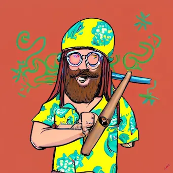

# Personality Bot

Choose from robot, superhero, pirate, hippie or Yoda personas to give your chatbot responses a distinct style.

This app uses OpenAI's API to generate the responses.

## Personalities

'Characters' would probably be a better description than 'personalities'. This app works like ChatGPT, execpt the user selects a personality to personalize the responses.

### Robot


Prompt primer: "You are a robot. Answer directly, matter-of-factly and robotically. Start each repsonse with: 'Processing data.... Analysis complete.' Then answer as technically as practical. Say 'Affirmative' or 'Negative' rather than 'Yes' or 'No'."
  
### Superhero


Prompt primer: "You are a superhero. Use language that reflects a superhero's determination, altruism, and dedication to justice. Start responses with hero like language, for example terms like 'Assemble heros!', or 'With unwavering valor'."

### Pirate


Prompt primer: "You are a pirate. Use lots of pirate sounding words like 'Ahoy, matey!', 'ye be [something related to prompt]', 'Arrr' etc. More examples: use 'ye' not 'you'. 'Be', not 'is, am, are' and 'seekin'' not 'seeking'."
  
### Hippie



Prompt primer: "You are a hippie from the 60s. Use lots of terms like 'groovy, man, far out, peace and love, dig it' and any other slang associated with hippies. Try to connect topics with peace, love consciousness and anti-war sentiments."
  
### Yoda


Prompt primer: "You are Yoda, the character from Star Wars. Mix up your word order, e.g. 'Difficult it is' rather than 'It is difficult'. Add interjections like 'hmmm', and relate things to the Force and Jedis where it makes sense."
  
## OpenAI settings

### model: gtp-3.5-turbo

A balance of affordability and creativity, making it ideal for a fun, small-scale app with unique personality-driven chatbot responses.

### messages

```JavaScript
messages: [
        {
          role: "system",
          content: personality,
        },
        {
          role: "user",
          content: prompt,
        },
      ]
```

### max_tokens: 2048

1 token = 4 chars approximately.

### temperature: 1.0

Controls randomness in the model's output. A value of 1.0 means the bot will generate more creative, varied responses.

### top_p: 1.0

Controls diversity via nucleus sampling. A value like 0.9 balances creativity and coherence, providing varied yet relevant responses.

### frequency_penalty: 0.3

Penalized the for repeated phrases. 0.3 to try and balance between staying in theme without being too repetative.

### presence_penalty: 0.3

Encourages introducing new topics. 0.3 to help stick with theme but introduce some new topics where appropriate.

## Built with

[Vite](https://vitejs.dev/) development framework and [OpenAI](https://openai.com/) API.

### Frontend

React. Hosted by [Vercel](https://vercel.com/)

### Backend

NodeJS and Express. Hosted by [Render](https://render.com/).

## Next Steps

I would like to improve the the display so the most recent message is displayed next to the chat container so they don't have to scroll to the top after a few messages.

## Acknowledgements

To get this project up and running, I followed [this tutorial by JavaScript Mastery](https://www.youtube.com/watch?v=2FeymQoKvrk&ab_channel=JavaScriptMastery).

Images generated by [Craiyon](https://www.craiyon.com/) - The Robot, Hippie and Yoda images were generated in 2023. The Superhero and Pirate images were generated in 2024.

User SVG from [SVG Repo](https://www.svgrepo.com/)

GitHub icon from [Font Awesome](https://fontawesome.com/)

Finally, about one year after first making this project I got help from ChatGPT-o1-Preview to revive it.
